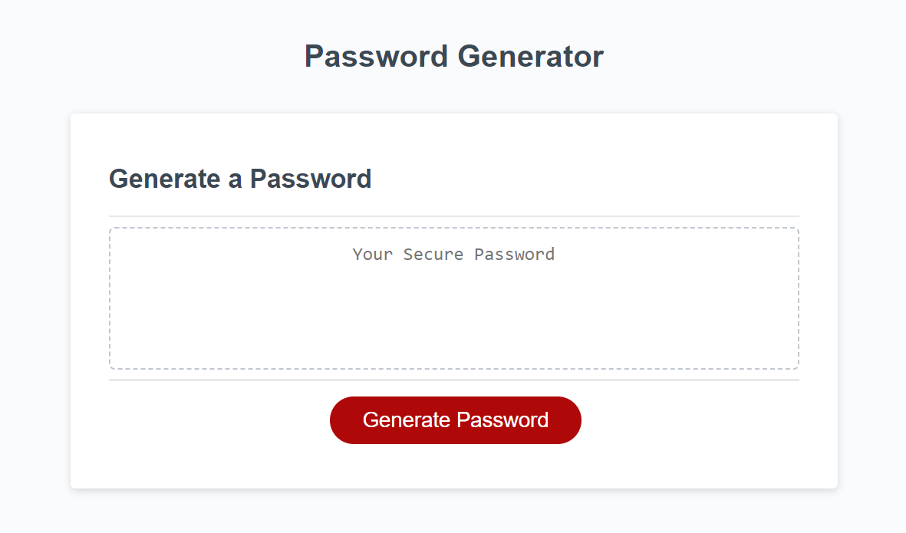
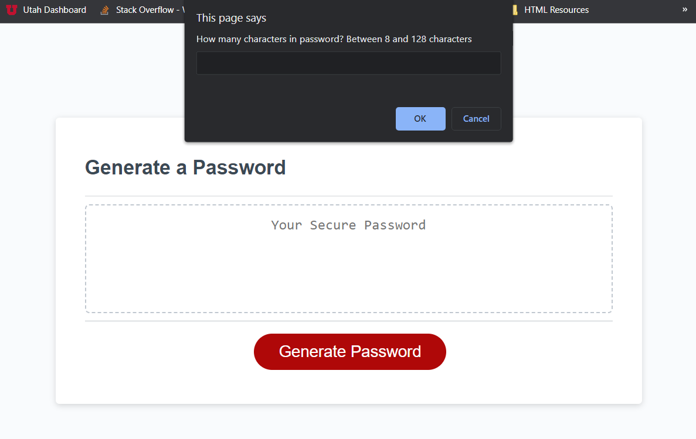
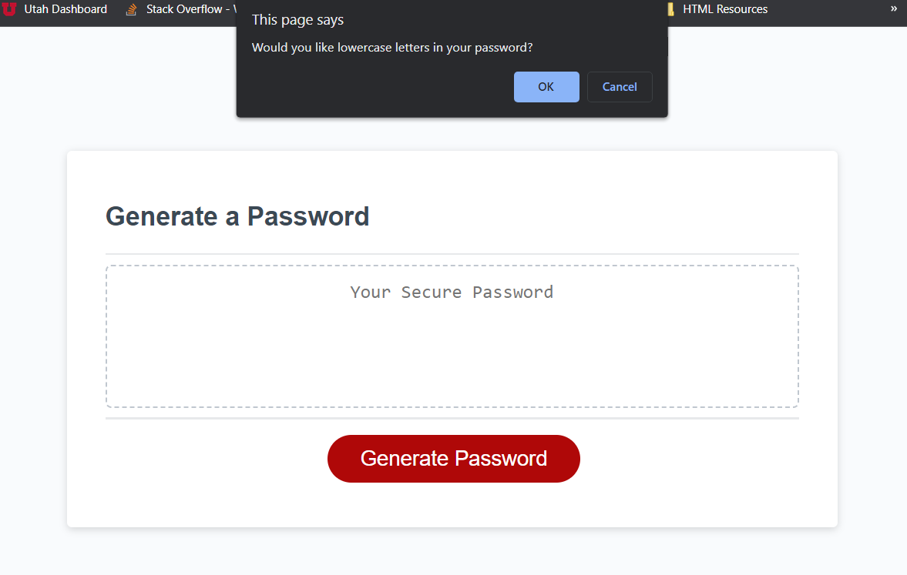
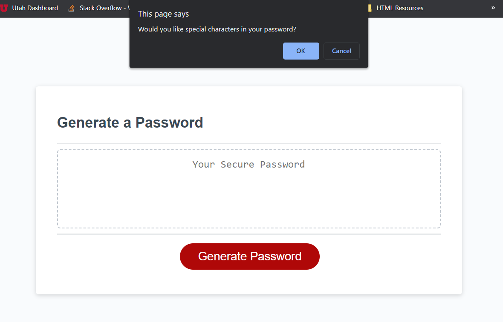
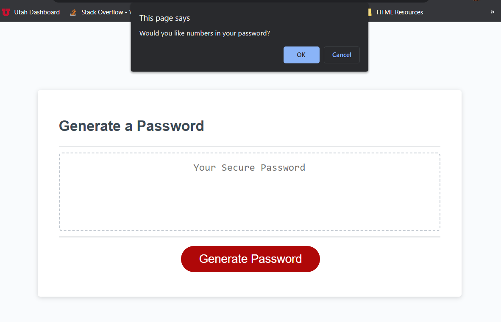
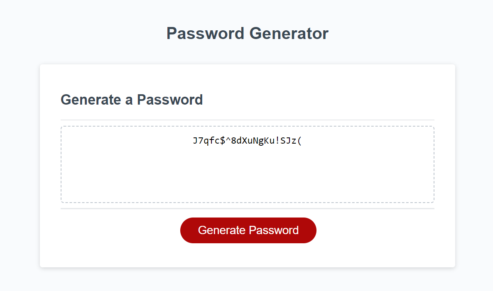

# Challenge-3
Password Generator is used to create a random password allowing you use use specific criteria. You need to first select the amount of characters (between 8-124). Then you can choose to use lower and upper case letters, numbers and special characters. Select "Generate Password" to begin the creation of the password

Base page ↑↑↑

Prompt to state the amount of characters ↑↑↑

Prompt to ask if lower characters are allowed ↑↑↑

Prompt to ask if upper characters are allowed ↑↑↑

Prompt to ask if special characters are allowed ↑↑↑

Prompt to ask if numbers are allowed ↑↑↑

generated password ↑↑↑